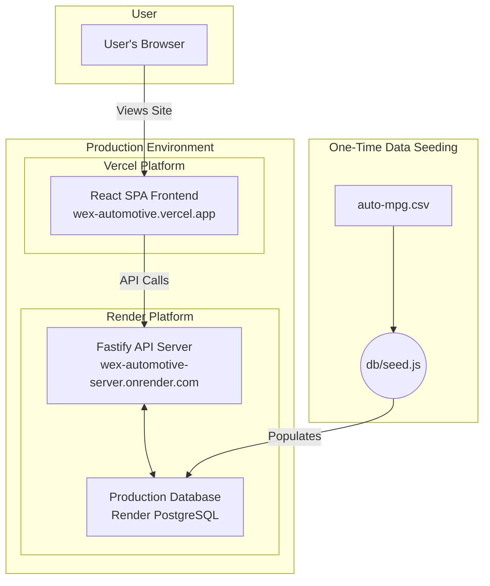
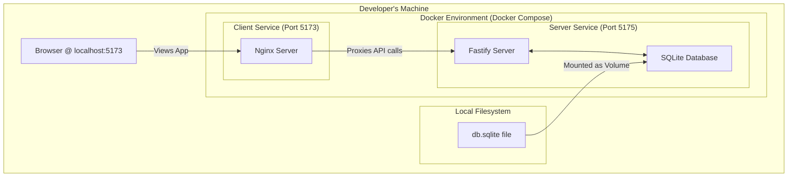
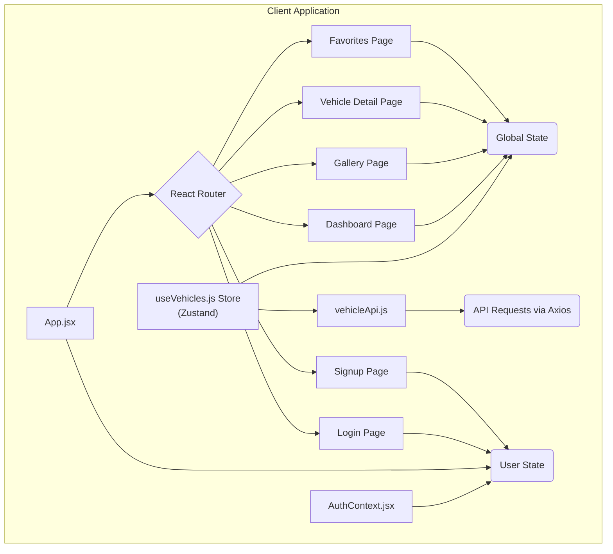
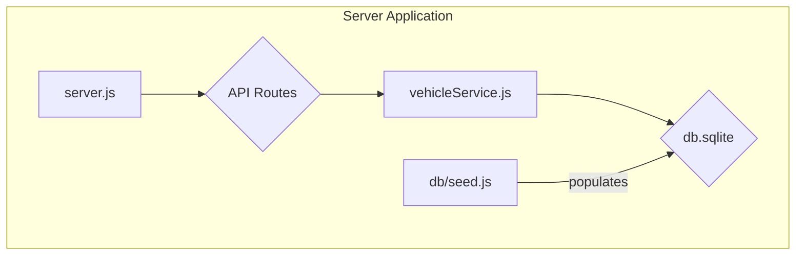
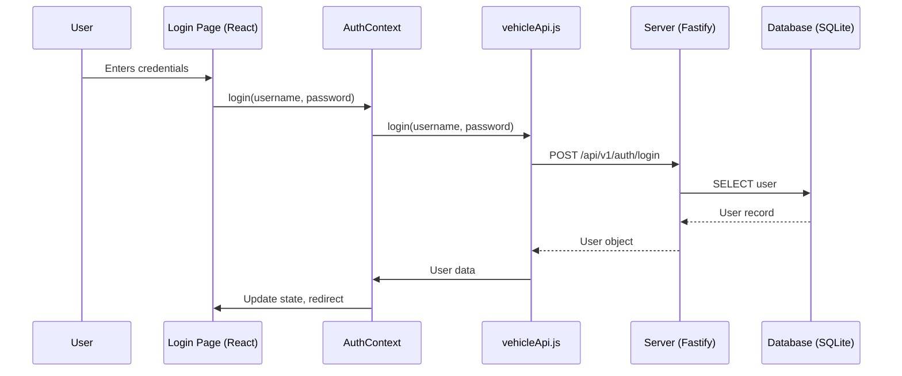
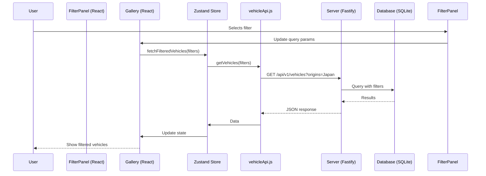

---
# WEX Automotive Data Explorer

This is a full-stack web application that allows users to explore a rich dataset of automotive information from 1970–1982. The application is architected with a modern stack, featuring a React frontend and a Fastify backend server, both containerized with Docker for easy setup and deployment.

**Live Production URLs**

- **Frontend (Vercel):** [https://wex-automotive.vercel.app](https://wex-automotive.vercel.app)
- **Backend (Render):** [https://wex-automotive-server.onrender.com](https://wex-automotive-server.onrender.com)
---

## Architecture & Design

This application is designed with two distinct environments in mind: a cloud-native setup for production and a containerized setup for local development.

### Production Architecture (Vercel & Render)



---

### Local Development Architecture (Docker Compose)



---

### Low-Level Design (LLD)

#### Component Diagrams

**Client (Frontend)**



**Server (Backend)**



---

#### Web Sequence Diagrams

**User Login Sequence**



**Filtering Vehicles Sequence**



---

## Getting Started

### Prerequisites

- [Node.js](https://nodejs.org/) (v18+)
- [npm](https://www.npmjs.com/)
- [Docker](https://www.docker.com/) & Docker Compose

### Installation & Running

1. **Clone the repository**

   ```bash
   git clone https://github.com/alokkumar-projects/wex-automotive.git
   cd wex-automotive
   git fetch origin
   git checkout feature/wex-automative-explorer
   ```

2. **Seed the database**

   ```bash
   cd server
   npm install
   npm run db:seed
   cd ..
   ```

3. **Run with Docker Compose**

   ```bash
   docker-compose up --build
   ```

   App runs at **[http://localhost:5173](http://localhost:5173)**.

---

## Key Features

### Frontend (Client)

- User authentication (login/signup)
- Interactive dashboard (scatter plot by MPG vs. weight, color-coded by origin)
- Gallery with advanced filtering & sorting
- Vehicle detail pages with parallax animation
- Favorites management (persisted in DB)
- Responsive, themeable UI (Tailwind, light/dark modes)

### Backend (Server)

- RESTful API (Fastify)
- Authentication endpoints
- Favorites management
- Data ingestion from `auto-mpg.csv`
- Normalized database schema

---

## Technology Stack

| Area         | Technology                                                                                   |
| ------------ | -------------------------------------------------------------------------------------------- |
| **Frontend** | React, Vite, Zustand, React Router, Tailwind CSS, Chart.js, Framer Motion, Axios, PrimeReact |
| **Backend**  | Node.js, Fastify, SQLite3                                                                    |
| **DevOps**   | Docker, Docker Compose                                                                       |
| **Testing**  | Vitest, React Testing Library                                                                |

---

## API Endpoints

- `POST /api/v1/auth/register` – Register user
- `POST /api/v1/auth/login` – Login user
- `GET /api/v1/vehicles` – List vehicles (with filters/sorting)
- `GET /api/v1/vehicles/:id` – Single vehicle by ID
- `GET /api/v1/stats` – Statistics & metadata
- `GET /api/v1/vehicles/scatter-plot` – Data for dashboard scatter plot
- `GET /api/v1/vehicles/names` – Vehicle names (autocomplete)
- `GET /api/v1/vehicles/by-ids` – Vehicles by ID list (favorites)
- `GET /api/v1/favorites/:userId` – User favorites
- `POST /api/v1/favorites` – Add favorite
- `DELETE /api/v1/favorites` – Remove favorite

---
