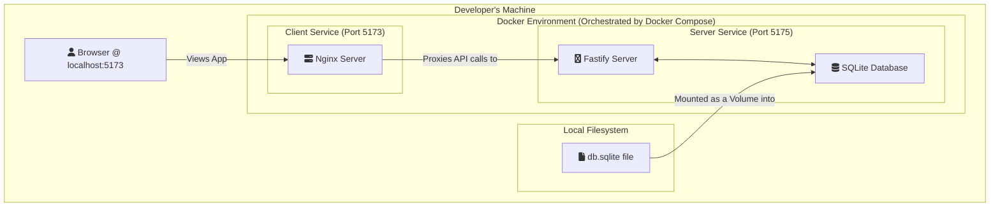

# WEX Automotive Data Explorer

This is a full-stack web application that allows users to explore a rich dataset of automotive information from 1970-1982. The application is architected with a modern stack, featuring a React frontend and a Fastify backend server, both containerized with Docker for easy setup and deployment.

**Live Production URLs**

- **Frontend (Vercel):** [https://wex-automotive.vercel.app](https://wex-automotive.vercel.app)
- **Backend (Render):** [https://wex-automotive-server.onrender.com]
  (https://wex-automotive-server.onrender.com)

---

## Architecture & Design

This application is designed with two distinct environments in mind: a cloud-native setup for production and a containerized setup for local development.

### Production Architecture (Vercel & Render)

The live application is deployed across specialized cloud platforms for optimal performance and scalability. The frontend is hosted on **Vercel**, a platform optimized for static site hosting and serverless functions, while the backend API and its database are hosted on **Render**.

```mermaid
graph TD
    subgraph "User"
        A[<i class='fa fa-user'></i> User's Browser]
    end

    subgraph "Production Environment"
        subgraph "Vercel Platform"
            B[<i class='fa fa-react'></i> React SPA Frontend<br/>(wex-automotive.vercel.app)]
        end

        subgraph "Render Platform"
            C[<i class='fa fa-node-js'></i> Fastify API Server<br/>(wex-automotive-server.onrender.com)]
            D[<i class='fa fa-database'></i> Production Database<br/>(e.g., Render PostgreSQL)]
            C <--> D
        end
    end

    subgraph "One-Time Data Seeding"
        E[<i class='fa fa-file-csv'></i> auto-mpg.csv] --> F((db/seed.js))
        F -- "Populates" --> D
    end

    A -- "Views Site" --> B
    B -- "API Calls" --> C

    classDef vercel fill:#f2f2f2,stroke:#000,stroke-width:2px;
    classDef render fill:#e6f9f0,stroke:#46a36c,stroke-width:2px;
    class B vercel;
    class C,D render;
```

**Data Flow:**

1.  **Deployment:** When the `main` branch is pushed, Vercel and Render automatically build and deploy the latest versions of the frontend and backend, respectively.
2.  **Data Seeding:** The production database on Render is populated once using the `db/seed.js` script, which processes the `auto-mpg.csv` data.
3.  **User Interaction:** A user visits the Vercel URL, loading the React application. The app then makes API calls to the backend service hosted on Render to fetch vehicle data.

### Local Development Architecture (Docker Compose)

For local development, the entire application is orchestrated using **Docker Compose**. This creates a consistent and isolated environment that mirrors the separated services of production but is easy to manage on a local machine.



**Data Flow:**

1.  **Data Seeding:** The developer runs `npm run db:seed` in the `server` directory, which creates a local `db.sqlite` file.
2.  **Docker Compose:** `docker-compose up` builds and starts the client and server containers.
3.  **Volume Mount:** The local `db.sqlite` file is mounted as a volume into the server container, making the data accessible to the Fastify API.
4.  **User Interaction:** The developer accesses `http://localhost:5173`. The React app, served by Nginx, makes API calls that are proxied to the Fastify server at `http://localhost:5175`.

---

## Getting Started

To get the application up and running on your local machine, follow these simple steps.

### Prerequisites

- [Node.js](https://nodejs.org/) (version 18 or higher)
- [npm](https://www.npmjs.com/) (usually comes with Node.js)
- [Docker](https://www.docker.com/) & Docker Compose

### Installation & Running

1.  **Clone the repository:**

    ```bash
    git clone https://github.com/alokkumar-projects/wex-automotive.git
    cd wex-automotive
    git fetch origin
    git checkout feature/wex-automative-explorer
    ```

2.  **Seed the Database:**
    Before running the application, you need to populate the database from the source CSV file.

    ```bash
    cd server
    npm install
    npm run db:seed
    cd ..
    ```

3.  **Run with Docker Compose:**
    This is the recommended way to run the application as it orchestrates both the client and server containers.

    ```bash
    docker-compose up --build
    ```

    The `--build` flag ensures that the Docker images are built before starting. The application will be available at `http://localhost:5173`.

---

## Key Features

### Frontend (Client)

- **User Authentication**: Full login and signup functionality, enabling personalized experiences.
- **Interactive Dashboard**: A scatter plot visualization showing the relationship between vehicle weight and MPG, color-coded by origin.
- **Dynamic Gallery & Filtering**: A gallery of all vehicles with a powerful filtering panel. Users can filter by name, origin, cylinders, and various numeric ranges (MPG, Weight, etc.).
- **Data Sorting**: The gallery can be sorted by multiple attributes like MPG, weight, and model year.
- **Vehicle Detail Page**: A dedicated page for each vehicle with a data-driven parallax effect where the animation is influenced by the car's acceleration value.
- **Favorites**: Authenticated users can mark vehicles as favorites, and this state is persisted in the database.
- **Responsive Design**: The application is fully responsive, built with **Tailwind CSS**.
- **Light/Dark Theme**: The application supports both light and dark themes, with the theme being persisted in local storage.

### Backend (Server)

- **Efficient RESTful API**: Built with Fastify to serve cleaned and structured vehicle data and pre-calculated statistics.
- **User Authentication**: Endpoints for user registration and login.
- **Favorites Management**: API endpoints for users to manage their favorite vehicles.
- **Data Processing**: The server reads from a tab-separated `auto-mpg.csv`, handles missing values, and normalizes headers before populating the database.

---

## Technology Stack

| Area         | Technology                                                                                                          |
| :----------- | :------------------------------------------------------------------------------------------------------------------ |
| **Frontend** | React, Vite, Zustand (for state management), React Router, Tailwind CSS, Chart.js, Framer Motion, Axios, PrimeReact |
| **Backend**  | Node.js, Fastify, SQLite3                                                                                           |
| **DevOps**   | Docker, Docker Compose                                                                                              |
| **Testing**  | Vitest, React Testing Library                                                                                       |

---

## API Endpoints

The server exposes the following endpoints:

- **`POST /api/v1/auth/register`**: Register a new user.
- **`POST /api/v1/auth/login`**: Login a user.
- **`GET /api/v1/vehicles`**: Returns a JSON array of vehicle objects. Supports filtering and sorting via query parameters.
- **`GET /api/v1/vehicles/:id`**: Returns a single vehicle object matching the provided `id`.
- **`GET /api/v1/stats`**: Returns a JSON object containing calculated statistics from the dataset, such as numeric ranges and unique categorical values.
- **`GET /api/v1/vehicles/scatter-plot`**: Returns the data needed for the scatter plot on the dashboard.
- **`GET /api/v1/vehicles/names`**: Returns a list of all vehicle names for the search autocomplete.
- **`GET /api/v1/vehicles/by-ids`**: Returns a list of vehicles for a given list of ids, used for the favorites page.
- **`GET /api/v1/favorites/:userId`**: Get all favorite vehicles for a user.
- **`POST /api/v1/favorites`**: Add a vehicle to a user's favorites.
- **`DELETE /api/v1/favorites`**: Remove a vehicle from a user's favorites.
