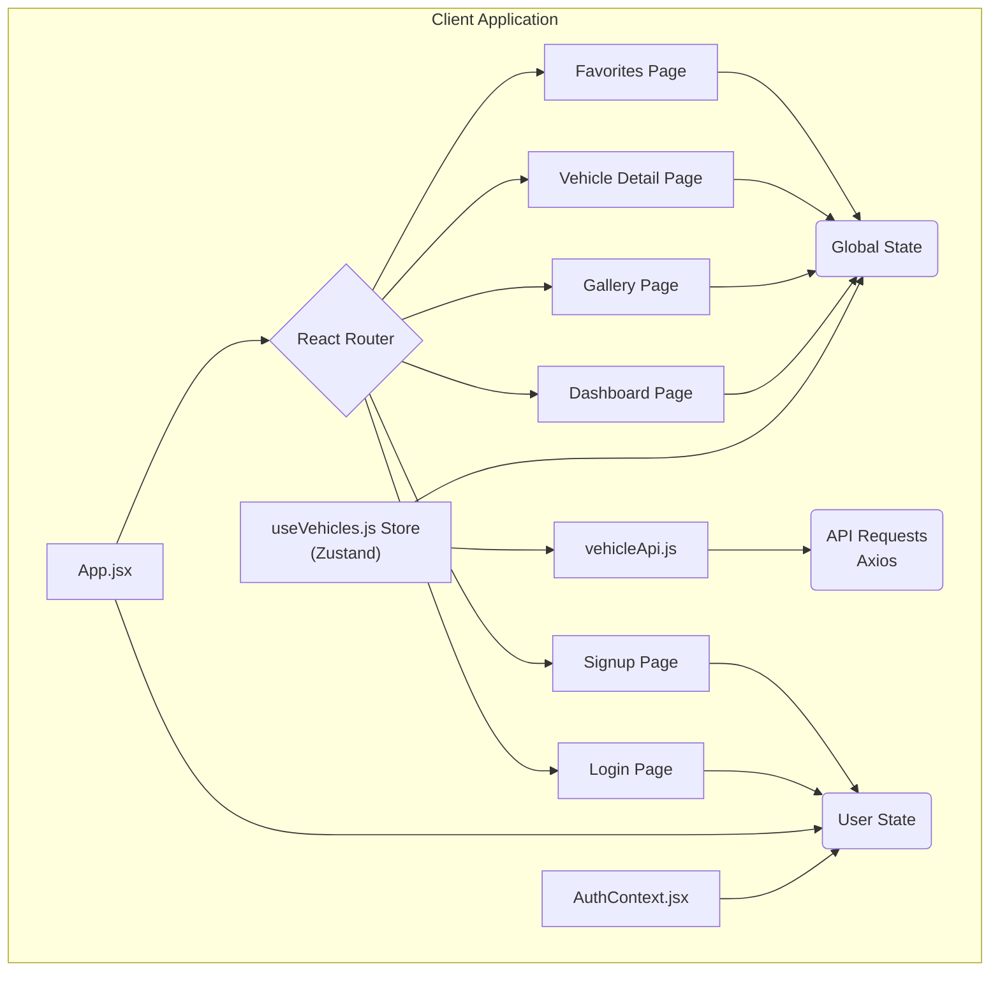
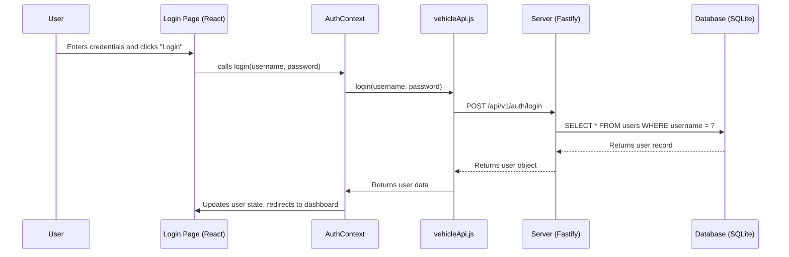
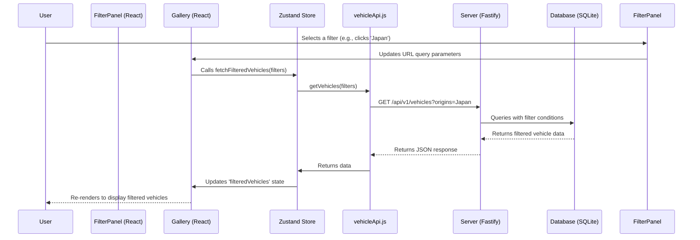

# WEX Automotive Data Explorer

This is a full-stack web application that allows users to explore a rich dataset of automotive information from 1970-1982. The application is architected with a modern stack, featuring a React frontend and a Fastify backend server, both containerized with Docker for easy setup and deployment.

**Live Production URLs**
Frontend (Vercel): [https://wex-automotive.vercel.app](https://wex-automotive.vercel.app)
Backend (Render): [https://wex-automotive-server.onrender.com](https://wex-automotive-server.onrender.com)

---

## Architecture & Design

### High-Level Design (HLD)

This diagram provides a comprehensive overview of the application's components, data flow, and infrastructure. The system is entirely containerized using Docker Compose, creating a clear separation between the client-side and server-side services.

**Data Flow & Lifecycle:**

1.  **Build/Seed Time**: The process begins with the raw `auto-mpg.csv` data file. A Node.js script (`db/seed.js`) is executed manually (`npm run db:seed`) to parse this file, clean the data, and populate a persistent **SQLite database file (`db.sqlite`)**.
2.  **Runtime**: When a user accesses the application, their browser receives a production-built React single-page application, served statically by an **Nginx** web server running in the `client` container.
3.  **Interaction**: The React application, running in the user's browser, makes API calls to the backend.
4.  **API & Database**: The **Fastify** server receives these API requests, queries the pre-populated SQLite database for the relevant vehicle data, and returns it to the client as a JSON payload. The SQLite database file is mounted into the server container via a Docker volume, ensuring data persistence.

---

### Low-Level Design (LLD)

#### Component Diagrams

This provides a more detailed look at the internal components of the client and server applications.

**Client (Frontend)**



**Server (Backend)**


---

#### Web Sequence Diagrams

**User Login Sequence**

This diagram illustrates the flow of a user logging into the application.



**Filtering Vehicles Sequence**

This diagram illustrates the flow of a common user action: applying a filter in the vehicle gallery.



---

## Getting Started

To get the application up and running on your local machine, follow these simple steps.

### Prerequisites

- [Node.js](https://nodejs.org/) (version 18 or higher)
- [npm](https://www.npmjs.com/) (usually comes with Node.js)
- [Docker](https://www.docker.com/) & Docker Compose

### Installation & Running

1.  **Clone the repository:**

    ```bash
    git clone https://github.com/alokkumar-projects/wex-automotive.git
    cd wex-automotive
    git fetch origin
    git checkout feature/wex-automative-explorer
    ```

2.  **Seed the Database:**
    Before running the application, you need to populate the database from the source CSV file.

    ```bash
    cd server
    npm install
    npm run db:seed
    cd ..
    ```

3.  **Run with Docker Compose:**
    This is the recommended way to run the application as it orchestrates both the client and server containers.

    ```bash
    docker-compose up --build
    ```

    The `--build` flag ensures that the Docker images are built before starting. The application will be available at `http://localhost:5173`.

---

## Key Features

### Frontend (Client)

- **User Authentication**: Full login and signup functionality, enabling personalized experiences.
- **Interactive Dashboard**: A scatter plot visualization showing the relationship between vehicle weight and MPG, color-coded by origin.
- **Dynamic Gallery & Filtering**: A gallery of all vehicles with a powerful filtering panel. Users can filter by name, origin, cylinders, and various numeric ranges (MPG, Weight, etc.).
- **Data Sorting**: The gallery can be sorted by multiple attributes like MPG, weight, and model year.
- **Vehicle Detail Page**: A dedicated page for each vehicle with a data-driven parallax effect where the animation is influenced by the car's acceleration value.
- **Favorites**: Authenticated users can mark vehicles as favorites, and this state is persisted in the database.
- **Responsive Design**: The application is fully responsive, built with **Tailwind CSS**.
- **Light/Dark Theme**: The application supports both light and dark themes, with the theme being persisted in local storage.

### Backend (Server)

- **Efficient RESTful API**: Built with Fastify to serve cleaned and structured vehicle data and pre-calculated statistics.
- **User Authentication**: Endpoints for user registration and login.
- **Favorites Management**: API endpoints for users to manage their favorite vehicles.
- **Data Processing**: The server reads from a tab-separated `auto-mpg.csv`, handles missing values, and normalizes headers before populating the database.

---

## Technology Stack

| Area         | Technology                                                                                                          |
| :----------- | :------------------------------------------------------------------------------------------------------------------ |
| **Frontend** | React, Vite, Zustand (for state management), React Router, Tailwind CSS, Chart.js, Framer Motion, Axios, PrimeReact |
| **Backend**  | Node.js, Fastify, SQLite3                                                                                           |
| **DevOps**   | Docker, Docker Compose                                                                                              |
| **Testing**  | Vitest, React Testing Library                                                                                       |

---

## API Endpoints

The server exposes the following endpoints:

- **`POST /api/v1/auth/register`**: Register a new user.
- **`POST /api/v1/auth/login`**: Login a user.
- **`GET /api/v1/vehicles`**: Returns a JSON array of vehicle objects. Supports filtering and sorting via query parameters.
- **`GET /api/v1/vehicles/:id`**: Returns a single vehicle object matching the provided `id`.
- **`GET /api/v1/stats`**: Returns a JSON object containing calculated statistics from the dataset, such as numeric ranges and unique categorical values.
- **`GET /api/v1/vehicles/scatter-plot`**: Returns the data needed for the scatter plot on the dashboard.
- **`GET /api/v1/vehicles/names`**: Returns a list of all vehicle names for the search autocomplete.
- **`GET /api/v1/vehicles/by-ids`**: Returns a list of vehicles for a given list of ids, used for the favorites page.
- **`GET /api/v1/favorites/:userId`**: Get all favorite vehicles for a user.
- **`POST /api/v1/favorites`**: Add a vehicle to a user's favorites.
- **`DELETE /api/v1/favorites`**: Remove a vehicle from a user's favorites.
